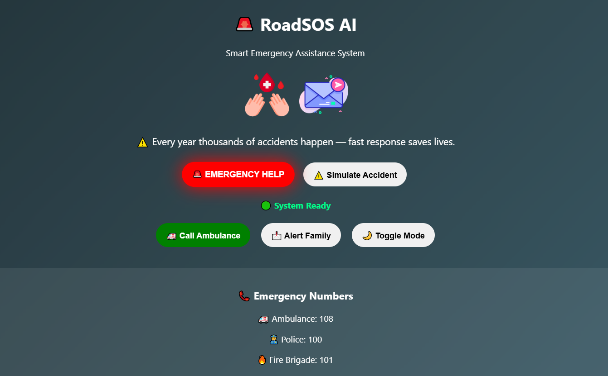
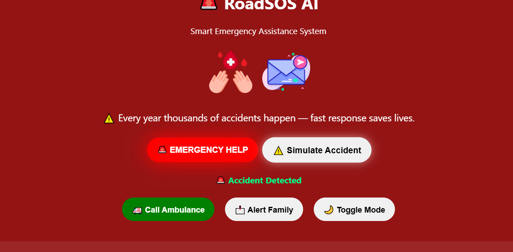
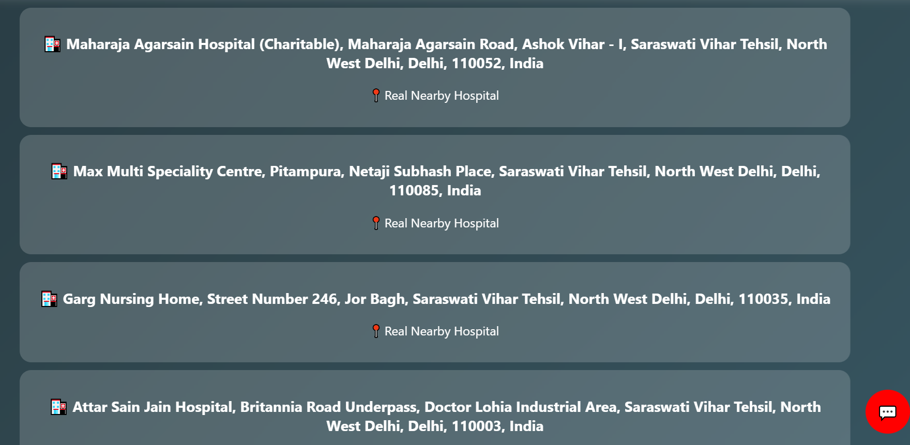
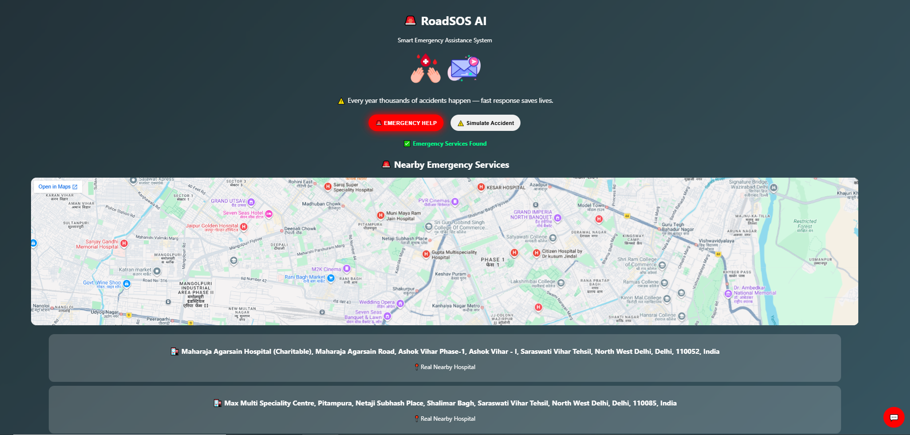
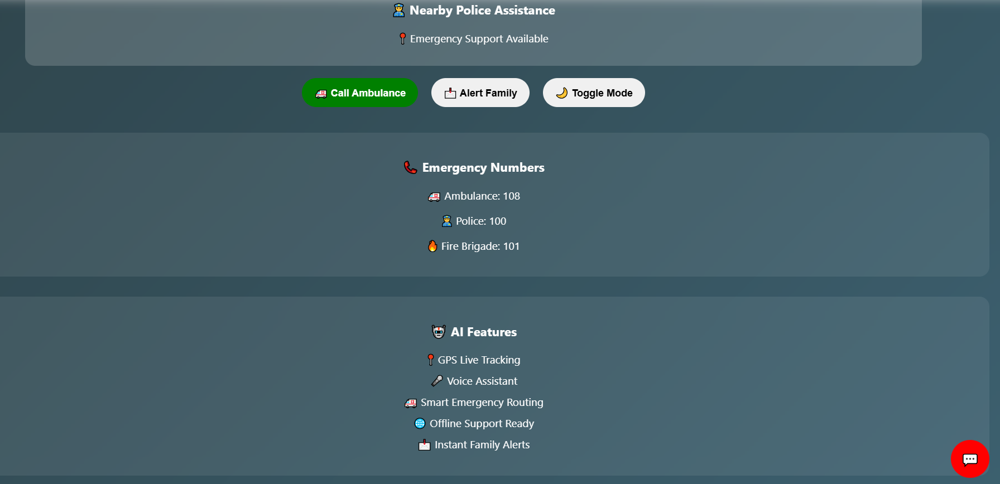
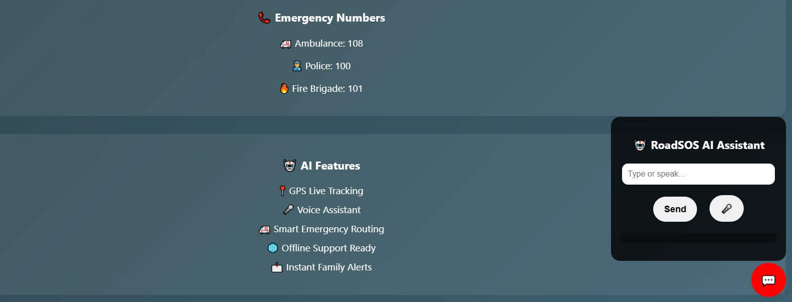

# 🚨 RoadSOS AI

Smart Emergency Assistance System built during Hackathon 2025 🚀

## 🔥 Features

* 📍 Live GPS Tracking
* 🏥 Nearby Hospital Detection
* 🎤 AI Voice Assistant
* 📩 Emergency Alerts
* 🗺️ Real-Time Maps
* 🚑 Emergency SOS
* 🌙 Dark Mode UI

## ⚙️ Tech Stack

* HTML
* CSS
* JavaScript
* OpenStreetMap API
* Geolocation API
* Speech Recognition API

## 📸 Screenshots

### Homepage

### Emergency Screen

### Hospitals

### Services Map

### AI Features

### Chatbot

## 🚀 Future Scope

* AI Accident Detection
* Live Ambulance Tracking
* Offline Emergency Support
* Multi-language AI

## 👨‍💻 Team

The Rockerz
Divyansh Srivastava

## 📌 Built During

Hackathon 2025

